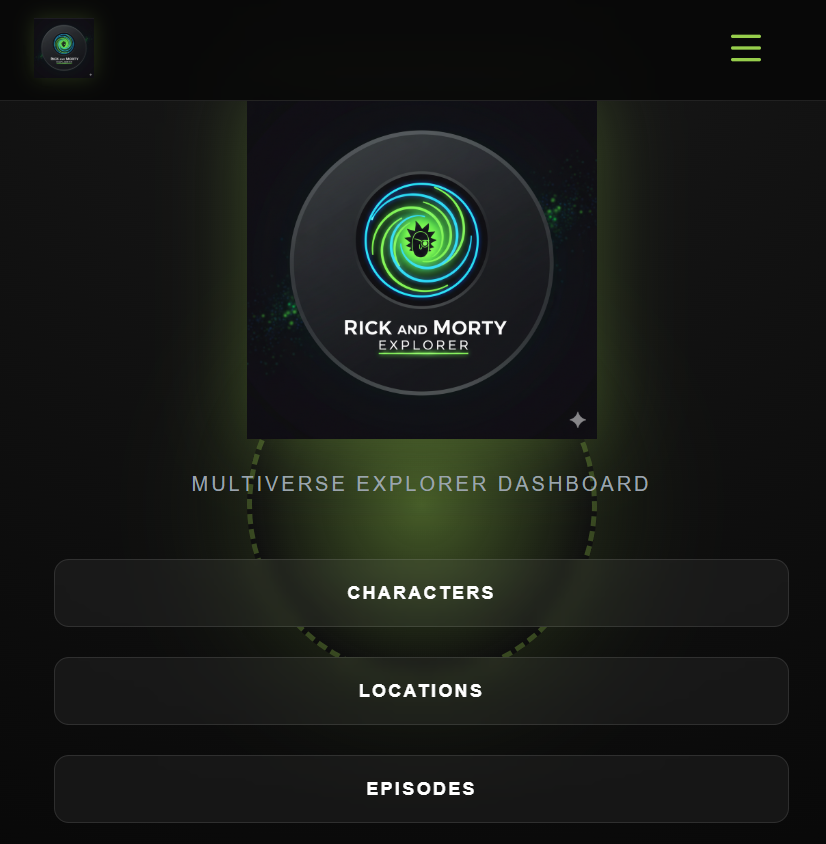
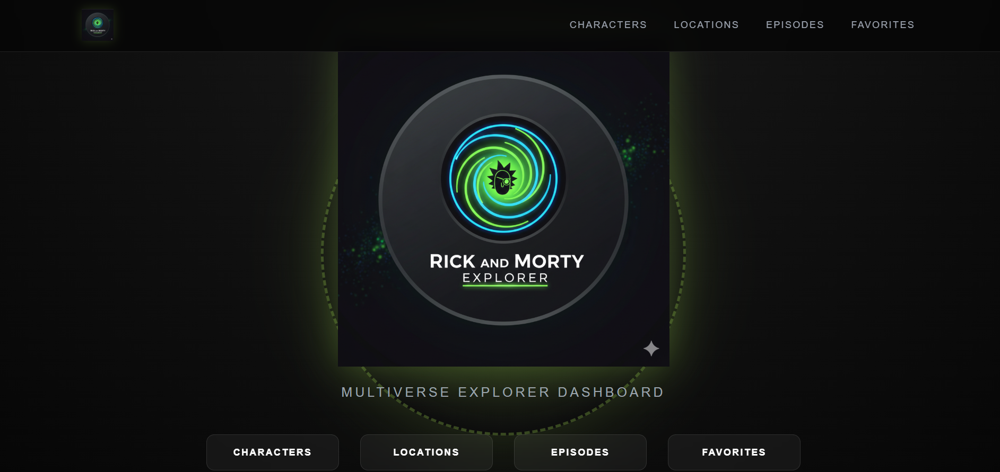
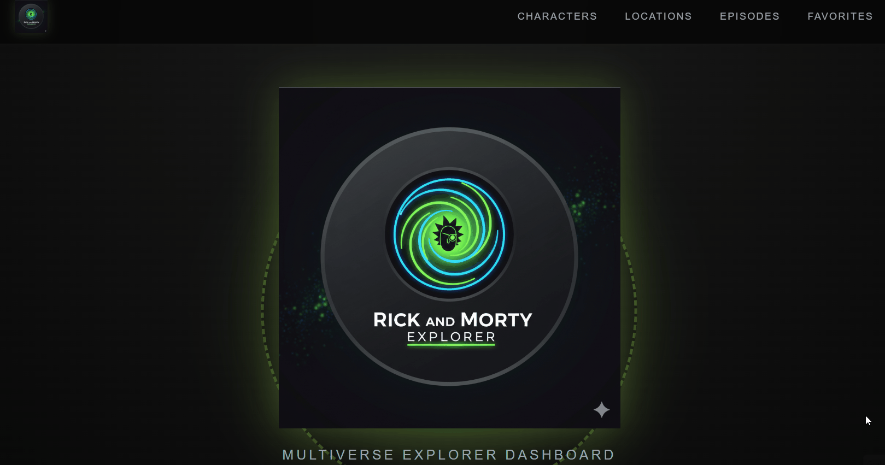
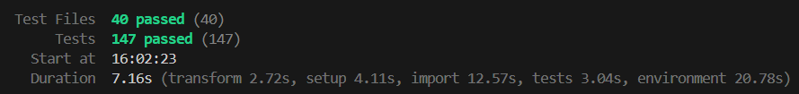
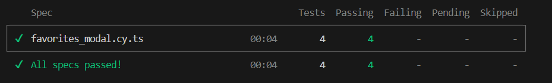

# RickDex 19 | Multiverse Explorer 🌀

<p align="center">
  
  
</p>

### 🚀 Elevator Pitch

Un explorador ultra-rápido de la API de Rick y Morty desarrollado para poner a prueba las nuevas capacidades de **React 19**, integrando una arquitectura orientada a la eficiencia con **TanStack Query** y una suite de pruebas **E2E robusta** que garantiza estabilidad total.

<p align="center">
  
</p>

---

## 🛠️ Tech Stack (Arquitectura y Herramientas)

He agrupado las tecnologías por su responsabilidad para garantizar una **Clean Architecture** de tipo modular con:

* **Core:** `React 19.20`.
* **Data Fetching & Cache:** `TanStack Query` (v5.90.20) combinado con `React Router Loaders` para una carga de datos anticipada y eficiente.
* **Testing Suite:** * **E2E:** `Cypress` con una estrategia avanzada de **Interceptores y Fixtures**.
* **Unit/Integration:** `Vitest` + `React Testing Library`.
* **Modal Context:** Uso de **React Context API** para centralizar la lógica de apertura/cierre y contenido del modal, permitiendo que cualquier componente dispare el modal sin pasar props innecesarias.
* **Optimización (Lazy Loading):** Implementación de `React.lazy` para la carga diferida de rutas y componentes pesados.
* **Styling:** CSS Modules para un diseño responsivo y encapsulado.
* **Tooling:** Vite, ESLint, Prettier.

---

## ✨ Key Features (Características Principales)

* 🔍 **Búsqueda y Exploración:** Navegación fluida entre personajes y episodios con carga asíncrona optimizada.
* 💖 **Sistema de Favoritos:** Persistencia en `localStorage` con validación de estados para evitar errores de hidratación.
* 🎭 **Modales de Elenco:** Visualización detallada de los personajes presentes en cada episodio mediante el uso de portales.
* 📱 **Responsive Design:** Interfaz adaptada para una experiencia impecable en móviles, tablets y escritorio.
* 🛡️ **Error Boundaries:** Gestión de errores a nivel de componente para evitar caídas totales de la aplicación.


---

## 🛡️ Estrategia de Testing

Dado que las APIs externas pueden ser inestables o limitar las peticiones (**Error 429**), he diseñado una suite de pruebas en **Cypress** que no depende de internet:

* **Interceptores & Fixtures:** Simulamos las respuestas de la API de Rick y Morty utilizando archivos JSON locales. Esto permite que los tests sean **100% deterministas**, eliminando el "flakiness" y permitiendo ejecuciones instantáneas.
* **Simulación de Usuario:** Probamos flujos completos, desde añadir un personaje a favoritos hasta verificar su persistencia tras recargar la página.
* **Manejo de LocalStorage:** Implementación de stubs para garantizar que la comunicación entre la UI y el almacenamiento persistente sea perfecta, evitando errores en el Error Boundary.

<p align="center">
  
  
</p>

---

## 🏗️ Arquitectura y Patrones

La estructura del proyecto sigue una separación clara de responsabilidades:

* **Services:** Lógica de comunicación con la API centralizada.
* **Hooks:** Lógica de negocio reutilizable (ej. manejo de favoritos).
* **Components:** UI atómica y componentes de composición.
* **Loaders:** Integración de `TanStack Query` con `React Router` para eliminar "spinners" innecesarios durante la navegación.

---

## 💡 Retos y Aprendizajes

**El desafío del "Rate Limit" (Error 429):**
Durante el desarrollo de los tests E2E, la API real comenzó a bloquear las peticiones por exceso de velocidad en modo `headless`.

* **Solución:** En lugar de ralentizar los tests con esperas artificiales (`cy.wait`), implementé una arquitectura de **Mocking total**. Al interceptar cada llamada de red y servir una **Fixture** local, conseguí que los tests fueran inmunes a los límites de la API y un 300% más rápidos.

---

## ⚙️ Instalación y Uso

1. **Clonar el repositorio:**
```bash
git clone https://github.com/fran960828/Entrega_2_React.git
cd Entrega_2_React

```


2. **Instalar dependencias:**
```bash
npm install

```


3. **Ejecutar en desarrollo:**
```bash
npm run dev

```


4. **Ejecutar Tests (Vitest + Cypress):**
```bash
# Vitest + react testing library
npm test

# Modo interactivo
npx cypress open

# Modo Headless (Terminal)
npx cypress run

```


